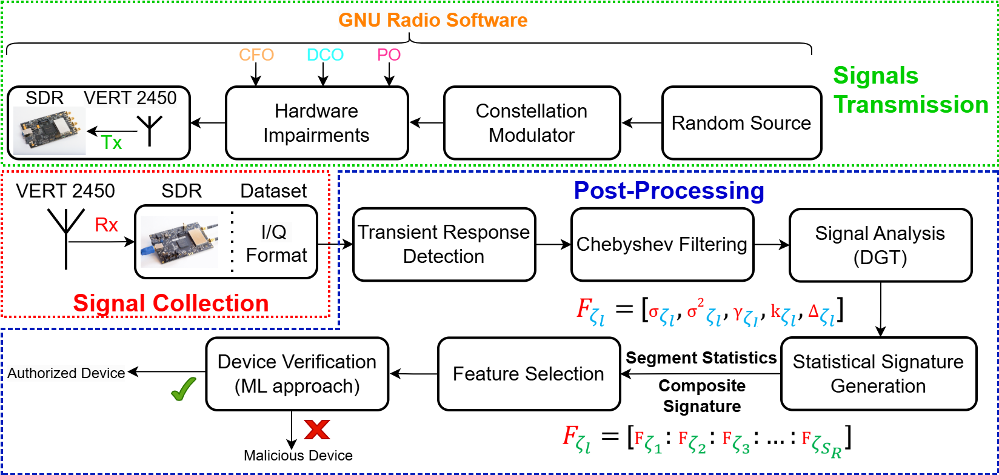

# **Physical Layer Authentication (PLA) Approach**

## **Description**

Physical Layer Authentication (PLA) is a technique that leverages the unique characteristics of physical signals to authenticate devices in wireless communication systems. This repository contains the code, datasets, and documentation necessary to reproduce the results presented in our paper `Robust Device Authentication in Multi-Node Networks: ML-Assisted Hybrid PLA
Exploiting Hardware Impairments` submitted to the ACSAC conference.

## **Abstract**

This repository contains the implementation of a hybrid physical layer authentication (PLA) method designed to enhance security in multi-node networks. The approach leverages inherent hardware impairments such as carrier frequency offset (CFO), direct current offset (DCO), and phase offset (PO) as features to authenticate devices and detect unauthorized access.

Machine learning (ML) models are utilized to perform device authentication without requiring prior knowledge of potential attacks. The effectiveness of this approach has been validated through experimental evaluations on a commercial software-defined radio (SDR) platform, achieving high authentication rates and reliable detection of malicious devices. 

This repository includes all necessary code, datasets, and documentation to reproduce the results and explore the PLA method under different scenarios.

## **Supported Environments and Hardware Requirements**
The code and models are supported on the following environments and hardware configurations:

- **`Operating Systems`**: Windows 11/Ubuntu 22.04.
- **`Processor`**: 12th Gen Intel® Core™ i7-12800H, 14 cores, 2.4 GHz base clock speed.
- **`Memory`**: 32 GB RAM.
- **`Python Version`**: 3.x 
- **`Specialized Hardware`**: BladeRF AX4 for data collection.


## **Repository Structure**

The structure of the repository is aligned with the process flow of our PLA approach, as illustrated in the following diagram:



This repository is organized into the following folders:
- **`src/`**: Contains all the functions and modules necessary for training and validating the models.
  - **`dataloader.py`**: Handles the loading and management of datasets.
  - **`evaluation.py`**: Provides functions for evaluating the performance of the models.
  - **`features_generation.py`**: Includes methods for generating features from raw data.
  - **`features_selections.py`**: Contains functions for selecting the most relevant features.
  - **`preprocessing.py`**: Handles the preprocessing of raw data.

- **`dataset/`**: Contains the processed data and any datasets used for training and validation.
  - **`processed_fingerprints_data.h5`**: The HDF5 file containing processed RF fingerprint data for each device.

- **`RF_Fingerprint.py`**: The main script for training and evaluation of RF fingerprinting models.

- **`rf_fingerprint_env.yml`**: YAML file for setting up the same environment using Conda.

## **Dataset**

The data used in this project are in I/Q format, collected using the BladeRF AX4 and GNU Radio software. It consists of raw signal data captured during various stages of the experiment. The dataset is crucial for reproducing the experiments and validating the PLA approach. 

**Note:** Due to the size of the dataset, it is stored in an external Drive. You can download the dataset from the following link: 
[Download Dataset from Google Drive](https://drive.google.com/file/d/1Hj6V6LVJnZMDRaQczt9gFOyiJhImjWnx/view?pli=1)

## **How to Run**

To reproduce the main experiment presented in the paper, follow these steps:

### Prerequisites

Before you begin, ensure you have met the following requirements:

- **Python version**: 3.x
- **Dependencies**: All necessary dependencies are listed in the `rf_fingerprint_env.yml` file.

### Setting Up the Environment

To set up the environment, you can use the `rf_fingerprint_env.yml` file:

```bash
conda env create -f rf_fingerprint_env.yml
conda activate <your-environment-name>
```

### Data Preparation

The data required for training is provided in the `dataset/processed_fingerprints_data.h5` file. This file contains the processed RF fingerprint data for each device, which is used to train and validate the models.

### Training the Model

To train the RF fingerprinting model, run the `RF_Fingerprint.py` script:

```bash
python RF_Fingerprint.py
```

This script will load the processed data, train the model, and validate its performance.

### Evaluating the Model

Evaluation of the model's performance can be done using the functions provided in the `evaluation.py` module. The script `RF_Fingerprint.py` includes an evaluation phase, but you can run additional evaluations as needed.


## **Main Results**

This section summarizes the main results you should expect when running the provided code, as discussed in our paper. The script now automates the testing of different machine learning models, feature selection methods, and scenarios.

### **Running the Experiments**

To run the experiments and automatically test different combinations of machine learning models, feature selection methods, and scenarios, simply execute the following script:

```bash
python RF_Fingerprint.py
```
### **Expected Output**

When you run the `RF_Fingerprint.py` script with the default settings, you will obtain the following performance metrics:

- **TDR (True Detection Rate)** for authorized nodes.
- **FDR (False Detection Rate)** for authorized nodes.
- **TDR (True Detection Rate)** for malicious nodes.


### **Key Results and Figures**

For each combination of machine learning models and feature selection methods, we have stored the best-performing models in `.json` files. These can be downloaded from [Download Dataset from Google Drive](https://drive.google.com/file/d/1Hj6V6LVJnZMDRaQczt9gFOyiJhImjWnx/view?pli=1). All results, including those for every combination of machine learning models, feature selection methods, and scenarios, are available in the `results` folder. 

To generate the key figures from the paper, run the following script:
```bash
python Plotting_Results.py

```
This script will generate the main figures using the saved models and their associated performance metrics.

The following figure illustrates the TDR and FDR for different combinations of FS methods and ML models across three scenarios.


Each subfigure shows the performance across the three scenarios (Scenario 1, Scenario 2, Scenario 3) and for different devices. The results demonstrate the variations in detection rates depending on the combination of FS methods and ML models used.

For a deeper analysis of the performance and detailed discussion, please refer to **Section 5.2.1. Performance Analysis** in the paper.

## **Documentation and Support**

For detailed instructions on setting up the environment, running experiments, and interpreting results, please refer to the documentation and the paper. If you encounter any issues or have questions, feel free to open an issue in this repository.

## Citation

If you use this code in your research, please cite the following paper:

```bibtex
@article{YourArticle,
  title={Your Title},
  author={Your Name and Others},
  journal={Journal Name},
  year={2024},
  volume={XX},
  pages={XX-XX},
  doi={XX.XXXX/XXXXXX},
}
```
